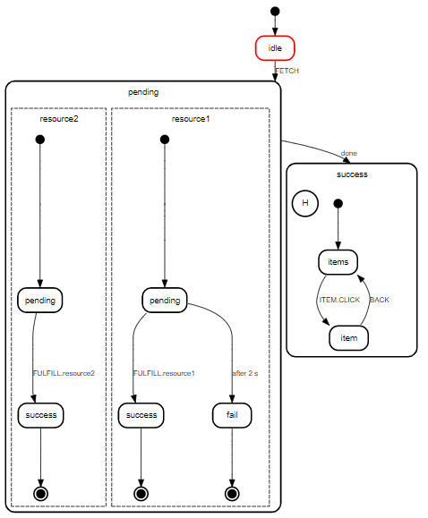
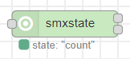
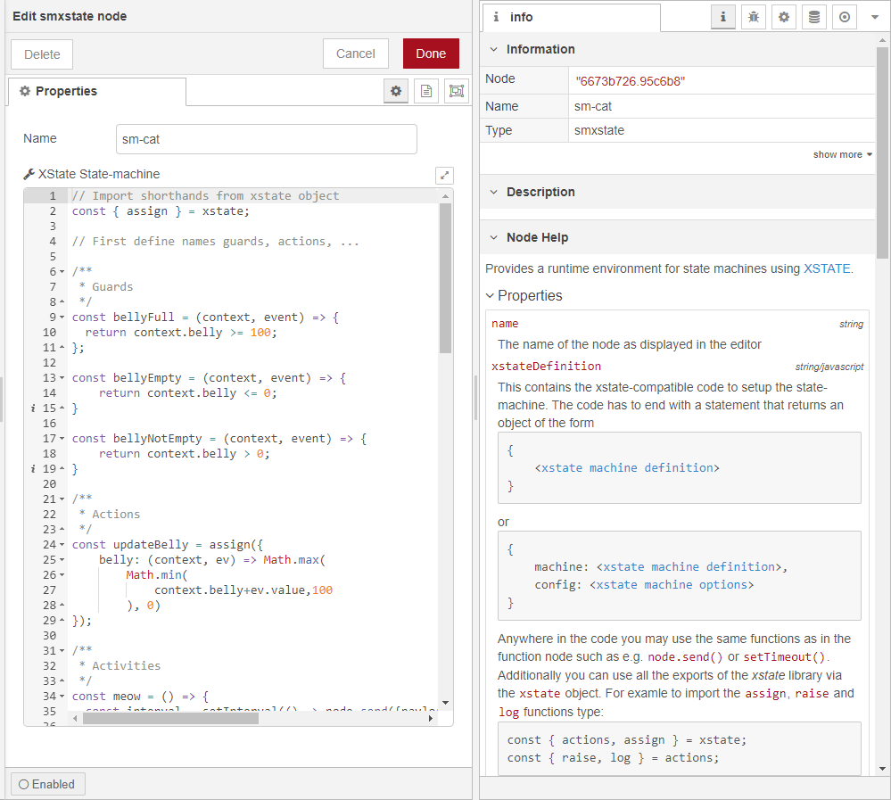
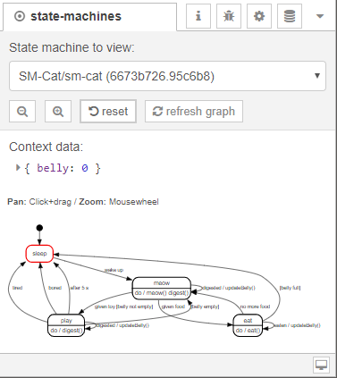
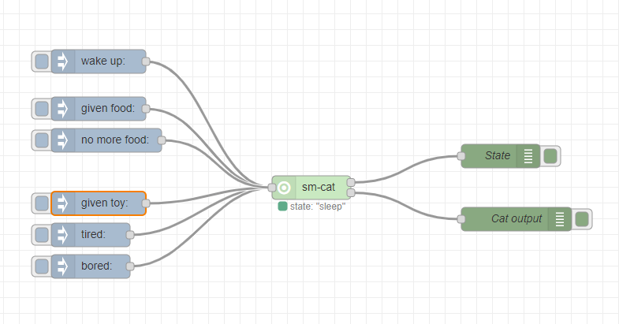
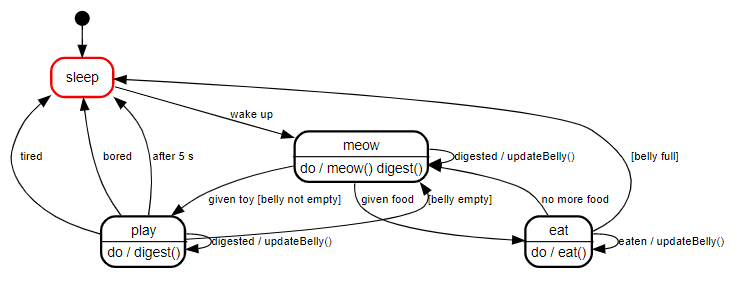

# Node Red XState-Machine

<p align="center"></p>

> Computing machines are like the wizards in fairy tales. They give you what you wish for, but do not tell you what that wish should be. \
> \- Norbert Wiener, founder of cybernetics

The goal of this package is to provide an easy yet flexible and customizable way to define state-machines within node-red and effortlessly observe their state.

<p align="center"></p>

## Introduction

The idea for this package is based on [node-red-contrib-finite-statemachine](https://github.com/lutzer/node-red-contrib-finite-statemachine) which was a very good starting point for me, but lacked some functionality that I wanted. If you only need to model simple state machines without guards, actions, time-based transitions, compund or parallel states this is the library you should go to!

This package provides state-machine functionality for node-red by utilizing the excellent [xstate library](https://www.npmjs.com/package/xstate) as basis. It allows for very complex systems, e.g. nested machines, nested states, parallel states, history, deep history etc. For visualiztaion the library [state-machine-cat](https://github.com/sverweij/state-machine-cat) comes into play. 

The rest of the implementation is based on node-red's function and debug nodes.

## Installation

* Via node-red: Search for "node-red-contrib-xstate-machine" in the palette manager
* Via terminal: Run `npm install node-red-contrib-xstate-machine` in your node-red user folder (typically `~/.node-red` or `%HOMEPATH%\.node-red`)

## Usage

Once this package is installed in node-red you will find two new items:
* A new node named `smxstate` (shorthand for state-machine xstate)
* A new sidebar (use the drop-down arrow) called `State-machines` for state-machine visualization

In the following the usage of both will be explained to get you started.

## The smxstate node



Within this node you will find a javascript editor similar to the function-node. Here you can define your state-machine in a (xstate-fashion)[https://xstate.js.org/docs/guides/machines.html]. The javascript code must end with a `return` that returns an object of the following form:

```js
return {
  machine: {
    ...
  },
  config: {
    ...
  }
}
```

The `machine` object is an xstate machine. For details on how to model or formulate your machine see the excellent [xstate docs](https://xstate.js.org/docs/guides/machines.html#configuration).

The `config` object contains all the named actions, activities, guards and services used in the `machine` object, see [here](https://xstate.js.org/docs/guides/machines.html#options).

See the node's help within node-red for further details:


## State-machines sidebar

The side bar allows for visualizing a machine instance's current data context and its state.



There are a number of buttons available to control the editor view/control the machine:
 - Reveal button (the zoom out icon) for the current machine instance: This shows and highlights the currently chosen machine in a flow. If it is within a subflow it highlights the subflow's instance.
 - Reveal button (the zoom in icon) for prototype machines: If the machine instance runs within a subflow then the subflow is openend and the prototype node is highlighted.
 - Reset button: This resets the current machine instance to its initial state and data context.
 - Refresh graph button: This redraws the visualization manually (useful e.g. if the instance was changed on the server by another user or in a separate editor).

## Example flows

### Simple statemachine with data object

The follwing example is based on the example machine from [state-machine-cat 😺](https://github.com/sverweij/state-machine-cat)

In the image below you can see the node-red setup for the example.



It tries to model a cat with 4 states
 - sleep
 - eat
 - play
 - meow

 Events from the cat's point of view are
  - given food
  - no more food available
  - given toy
  - wake up
  - tired
  - bored

The cat has an internal value-context containing the belly filling level.

There are several state-transitions with guards, e.g. `[belly empty]` or `[belly full]` as well as timed transitions (see the image below).



Enter the following code snippet into a `smxstate` node or load the example flow [from here](examples/flows/sm-cat-flow.json) into node-red to get the example started:

```js
// Import shorthands from xstate object
const { assign } = xstate; 

// First define names guards, actions, ...

/**
 * Guards
 */
const bellyFull = (context, event) => {
  return context.belly >= 100;
};

const bellyEmpty = (context, event) => {
    return context.belly <= 0;
}

const bellyNotEmpty = (context, event) => {
    return context.belly > 0;
}

/**
 * Actions
 */
const updateBelly = assign({
    belly: (context, ev) => Math.max(
        Math.min(
            context.belly+ev.value,100
        ), 0)
});

/**
 * Activities
 */
const meow = () => {
  const interval = setInterval(() => node.send({payload: "MEOW!"}), 2000);
  return () => clearInterval(interval);
};

/**
 * Services
 * see https://xstate.js.org/docs/guides/communication.html#invoking-callbacks
 */
const eat = (ctx, ev) => (cb) => {
    const id = setInterval(() => cb({
      type: 'eaten',
      value: 5
    }),500);
    return () => clearInterval(id);
};

const digest = (ctx, ev) => (cb) => {
    const id = setInterval(() => cb({
      type: 'digested',
      value: -5
    }),500);
    return () => clearInterval(id);
}

/***************************
 * Main machine definition * 
 ***************************/
 return {
  machine: {
    context: {
        belly: 0    // Belly state, 100 means full, 0 means empty
    },
    initial: 'sleep',
    states: {
      sleep: {
          on: {
              'wake up': 'meow',
          }
      },
      meow: {
          invoke: { src: 'digest' },
          on: {
              'given toy': { target: 'play', cond: 'belly not empty' },
              'given food': 'eat',
              'digested': { actions: 'updateBelly' }
          },
          activities: ['meow']
      },
      play: {
          invoke: { src: 'digest' },
          on: {
              tired: 'sleep',
              bored: 'sleep',
              'digested': { actions: 'updateBelly' },
              '': { target: 'meow', cond: 'belly empty' }
          },
          after: {
              5000: 'sleep',
          }
      },
      eat: {
          invoke: { src: 'eat' },
          on: {
              '': { target: 'sleep', cond: 'belly full' },
              'no more food': { target: 'meow' },
              'eaten': { actions: 'updateBelly' }
          }
      }
    }
  },
  // Configuration containing guards, actions, activities, ...
  // see above
  config: {
      guards: { "belly full": bellyFull, "belly not empty": bellyNotEmpty, "belly empty": bellyEmpty },
      activities: { meow },
      actions: { updateBelly },
      services: { eat, digest }
  }
}
```

This will give you a state machine to play with. It incorporates actions, delayed events, services, guards and internal data context. Observe the state-machine's state in the visualization panel while you inject events.

## Development

* Install dependencies using `npm install`
* Trigger the build tool-chain using `npm run devbuild` to create a development build version that is easy to debug. If you use Visual Studio Code for development you can use the provided launch.json to run a node-red environment where you can quickly test the node.
* Running `npm run build` will create deployable production output in the `./dist` directory.

## Acknowledgements

* To "Access Denied" for code snippet on [SVG zooming & panning](https://stackoverflow.com/a/52640900/542269)

## Caveats

* If you use multiple nested state-machines using [services](https://xstate.js.org/docs/guides/communication.html#the-invoke-property), only the returned machine object will get rendered in the state-machines panel and the nested machines won't be drawn.
* It is not possible to update the context from within an activity. Activities are per definition only fire-and-forget effects without communication back to the machine ([see the post here](https://spectrum.chat/statecharts/general/update-context-from-an-activity~21c39e88-bc82-44c3-88d4-d33c5738f5d4)). Instead you have to use [services](https://xstate.js.org/docs/guides/communication.html). See the sm-cat example's eat and digest services. In xstate V5 activities will be replaced by services completely.
* 🚨 **Beware of copy-pasting flows** that incorporate `smxstate` nodes from the internet. Although the javascript code provided within a node is evaluated in a node.js vm environment it is easy to paste malicious code. See [this blog post](https://odino.org/eval-no-more-understanding-vm-vm2-nodejs/) for more information. To make sure nothing malicious is pasted, take a look at the javascript code within the node before deploying it in node-red.